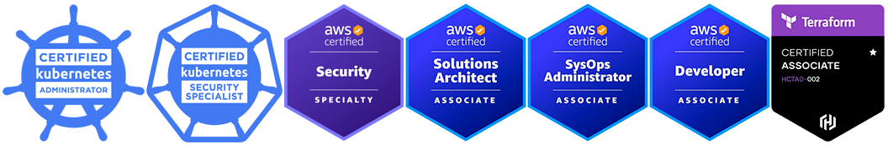

## Volodymyr Dovhopol	
Region: 	 Kyiv	 	

Phone number:	 0977279286	

E-mail:	              vidovgopol@gmail.com	

Skype:	              vova.dovgopol	

Linkedin profile: [Linkedin]

GitHub account: [GitHub]

# DevOps

Certification

-	AWS Certified Solution Architect – Associate
-	AWS Certified SysOps Administrator – Associate
-	AWS Certified Developer – Associate
-	Terraform Certified Associate
-	Basics of DevOps and Kubernetes – GlobalLogic offered through Prometheus

## Skills

AWS, Linux, Networking, Git, GitHub Actions CICD, ArgoCD, Terraform, Docker, Kubernetes, Zabbix, VMWare, Blade Servers, SAN, FC, NAS, Network Security, Cisco, NGFW, IPS, VPN, IPSec
